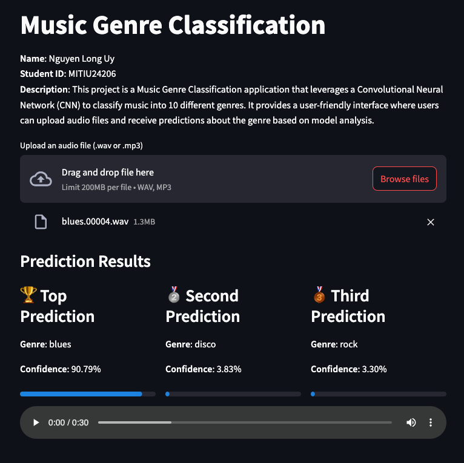

# Music Genre Classification Project

## Project Overview
This project is a **Music Genre Classification** application that leverages a Convolutional Neural Network (CNN) to classify music into 10 different genres. It provides a user-friendly interface where users can upload audio files and receive predictions about the genre based on model analysis.

### Project Metadata
- **Name**: Nguyen Long Uy
- **Student ID**: MITIU24206
- **Genres Included**: Blues, Classical, Country, Disco, Hiphop, Jazz, Metal, Pop, Reggae, Rock

## Features
- **Multi-Genre Classification**: Identifies music genre from a set of 10 predefined genres.
- **User-Friendly Interface**: Easy-to-use upload interface for `.wav` and `.mp3` files.
- **Top Predictions Displayed**: Shows the top three most probable genres with confidence percentages.

## Setup Instructions

### Step 1: Clone the Repository
To start, clone this repository to your local machine:
```bash
git clone <repository-url>
cd <repository-name>
```

### Step 2: Set Up a Virtual Environment
Create a virtual environment to manage dependencies:
```bash
python -m venv env
source env/bin/activate  # On Windows use `env\Scripts\activate`
```

### Step 3: Install Dependencies
Install all required libraries using the `requirements.txt` file:
```bash
pip install -r requirements.txt
```

### Step 4: Run the Application Locally
Launch the application locally using Streamlit:
```bash
streamlit run app.py
```

## Usage Instructions
1. **Upload an Audio File**: Use the upload section to add an audio file in `.wav` or `.mp3` format.
2. **Start Classification**: Click "Start" to process the file.
3. **View Results**: The app will display the top three most likely genres for the uploaded file, along with their probabilities.

## Repository Structure
```
├── app.py                  # Main application file
├── templates/              # HTML templates for the app
├── static/css/             # CSS files for styling
├── requirements.txt        # Python dependencies
└── README.md               # Project documentation
```

## Live demo
https://uynguyenappio-fvfzhtd8ucnrkfunccibwh.streamlit.app/


## Acknowledgments
This project was developed as part of a coursework requirement and serves as a practical implementation of machine learning for music classification.

---
Enjoy using this app for music genre classification!
